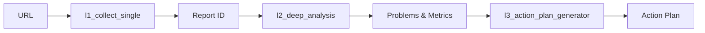
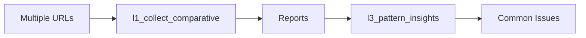
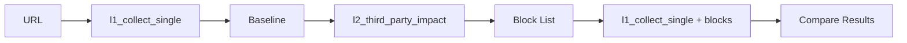

# MCP Integration Guide

## Overview

The Model Context Protocol (MCP) enables AI assistants to use Lighthouse analysis tools through a standardized interface. This guide explains how to integrate and use these tools effectively.

## Setting Up MCP Server

### Starting the Server

```bash
# Start MCP server
lhmcp --mcp

# With custom port
MCP_PORT=3000 lhmcp --mcp

# With debug logging
DEBUG=mcp:* lhmcp --mcp
```

### Server Configuration

The MCP server exposes all available tools automatically. No additional configuration is required.

## Tool Categories and Naming

### Tool Naming Convention

Tools follow a consistent naming pattern:
- `l1_*` - Collection layer tools (data gathering)
- `l2_*` - Analysis layer tools (data processing)
- `l3_*` - Intelligence layer tools (strategic insights)

### Available Tools by Category

#### Data Collection (L1)
```typescript
l1_collect_single       // Single URL analysis
l1_collect_multi        // Multiple URL analysis
l1_collect_comparative  // Comparative analysis
l1_get_report          // Retrieve stored report
l1_list_reports        // List all reports
```

#### Analysis Tools (L2)
```typescript
l2_deep_analysis       // Comprehensive analysis
l2_critical_chain      // Request chain analysis
l2_unused_code         // Unused CSS/JS detection
l2_third_party_impact  // Third-party script impact
l2_lcp_chain_analysis  // LCP critical path
l2_score_analysis      // Score breakdown
l2_weighted_issues     // Prioritized issues
l2_patterns           // Pattern detection
```

#### Intelligence Tools (L3)
```typescript
l3_action_plan_generator  // Generate action plans
l3_performance_budget     // Budget compliance
l3_pattern_insights       // Cross-site patterns
```

## Integration Examples

### Claude Desktop

Add to `claude-desktop-config.json`:

```json
{
  "mcpServers": {
    "lighthouse": {
      "command": "lhmcp",
      "args": ["--mcp"],
      "env": {
        "DEBUG": "mcp:*"
      }
    }
  }
}
```

### Custom MCP Client

```javascript
const { Client } = require('@modelcontextprotocol/sdk');

class LighthouseMCPClient {
  constructor() {
    this.client = new Client();
  }

  async connect() {
    await this.client.connect('lhmcp', ['--mcp']);
  }

  async analyzeUrl(url) {
    // Step 1: Collect data
    const collectResult = await this.client.callTool('l1_collect_single', {
      url,
      device: 'mobile',
      categories: ['performance']
    });

    // Step 2: Deep analysis
    const analysis = await this.client.callTool('l2_deep_analysis', {
      reportId: collectResult.reportId
    });

    return analysis;
  }

  async compareWebsites(urls) {
    const results = await this.client.callTool('l1_collect_comparative', {
      urls,
      device: 'mobile'
    });

    return results;
  }
}
```

### Python Integration

```python
import json
import subprocess
from typing import Dict, Any

class LighthouseMCP:
    def __init__(self):
        self.process = subprocess.Popen(
            ['lhmcp', '--mcp'],
            stdin=subprocess.PIPE,
            stdout=subprocess.PIPE,
            stderr=subprocess.PIPE,
            text=True
        )

    def call_tool(self, tool_name: str, params: Dict[str, Any]) -> Dict:
        request = {
            "jsonrpc": "2.0",
            "method": "tools/call",
            "params": {
                "name": tool_name,
                "arguments": params
            },
            "id": 1
        }

        self.process.stdin.write(json.dumps(request) + '\n')
        self.process.stdin.flush()

        response = json.loads(self.process.stdout.readline())
        return response.get('result', {})

    def analyze_performance(self, url: str) -> Dict:
        # Collect report
        collect_result = self.call_tool('l1_collect_single', {
            'url': url,
            'device': 'mobile'
        })

        # Analyze
        analysis = self.call_tool('l2_deep_analysis', {
            'reportId': collect_result['reportId']
        })

        return analysis
```

## Tool Usage Patterns

### Basic Analysis Flow



### Comparative Analysis Flow



### Progressive Analysis Flow



## Best Practices

### 1. Efficient Tool Chaining

```javascript
// Good: Reuse report IDs
const { reportId } = await callTool('l1_collect_single', { url });
const analysis = await callTool('l2_deep_analysis', { reportId });
const unused = await callTool('l2_unused_code', { reportId });
const chains = await callTool('l2_critical_chain', { reportId });

// Bad: Collecting multiple times
const analysis = await callTool('l2_deep_analysis', { url }); // Collects
const unused = await callTool('l2_unused_code', { url });     // Collects again
```

### 2. Error Handling

```javascript
try {
  const result = await callTool('l1_collect_single', { url });
  if (!result.success) {
    console.error('Collection failed:', result.error);
    return;
  }
  // Process result
} catch (error) {
  console.error('Tool call failed:', error);
}
```

### 3. Batch Operations

```javascript
// Process multiple URLs efficiently
async function batchAnalyze(urls) {
  const collectPromises = urls.map(url =>
    callTool('l1_collect_single', { url })
  );

  const results = await Promise.all(collectPromises);

  const analysisPromises = results.map(r =>
    callTool('l2_deep_analysis', { reportId: r.reportId })
  );

  return Promise.all(analysisPromises);
}
```

### 4. Caching Results

```javascript
const cache = new Map();

async function getCachedAnalysis(url) {
  if (cache.has(url)) {
    const cached = cache.get(url);
    if (Date.now() - cached.timestamp < 3600000) { // 1 hour
      return cached.data;
    }
  }

  const result = await analyzeUrl(url);
  cache.set(url, {
    data: result,
    timestamp: Date.now()
  });

  return result;
}
```

## Tool Input/Output Reference

### L1 Tools

#### l1_collect_single
```typescript
// Input
{
  url: string;
  device?: 'mobile' | 'desktop';
  categories?: string[];
  throttling?: boolean;
}

// Output
{
  reportId: string;
  url: string;
  performanceScore: number;
  metrics: {
    lcp: number;
    fcp: number;
    cls: number;
    tbt: number;
  };
}
```

### L2 Tools

#### l2_deep_analysis
```typescript
// Input
{
  reportId?: string;
  url?: string;
  includeChains?: boolean;
  includeUnusedCode?: boolean;
}

// Output
{
  analysis: {
    score: number;
    metrics: object;
    problems: Problem[];
    recommendations: string[];
  };
}
```

### L3 Tools

#### l3_action_plan_generator
```typescript
// Input
{
  reportId?: string;
  url?: string;
  includeTools?: string[];
}

// Output
{
  actionPlan: Action[];
  estimatedImpact: {
    scoreImprovement: number;
    loadTimeReduction: number;
  };
}
```

## Debugging

### Enable Debug Logging

```bash
# All MCP communication
DEBUG=mcp:* lhmcp --mcp

# Specific components
DEBUG=mcp:server lhmcp --mcp
DEBUG=mcp:tools lhmcp --mcp
```

### Common Issues

#### Tool Not Found
```javascript
// Check available tools
const tools = await client.callTool('system.listTools');
console.log('Available tools:', tools);
```

#### Invalid Parameters
```javascript
// Validate parameters before calling
const schema = await client.getToolSchema('l2_deep_analysis');
console.log('Expected parameters:', schema.inputSchema);
```

#### Timeout Issues
```javascript
// Set longer timeout for slow operations
const result = await client.callTool('l1_collect_single', {
  url: 'https://slow-site.com',
  timeout: 60000 // 60 seconds
});
```

## Advanced Usage

### Custom Tool Wrappers

```typescript
class LighthouseTools {
  constructor(private client: MCPClient) {}

  async deepAnalyze(url: string): Promise<AnalysisResult> {
    // Collect with retry logic
    let reportId;
    for (let i = 0; i < 3; i++) {
      try {
        const result = await this.client.callTool('l1_collect_single', {
          url,
          device: 'mobile'
        });
        reportId = result.reportId;
        break;
      } catch (error) {
        if (i === 2) throw error;
        await new Promise(r => setTimeout(r, 1000));
      }
    }

    // Parallel analysis
    const [deep, unused, chains] = await Promise.all([
      this.client.callTool('l2_deep_analysis', { reportId }),
      this.client.callTool('l2_unused_code', { reportId }),
      this.client.callTool('l2_critical_chain', { reportId })
    ]);

    return {
      problems: deep.analysis.problems,
      unusedCode: unused.unusedCode,
      criticalChains: chains.criticalChain
    };
  }
}
```

### Stream Processing

```javascript
async function* streamAnalysis(urls) {
  for (const url of urls) {
    const result = await callTool('l1_collect_single', { url });
    const analysis = await callTool('l2_deep_analysis', {
      reportId: result.reportId
    });

    yield {
      url,
      score: analysis.analysis.score,
      problems: analysis.analysis.problems
    };
  }
}

// Usage
for await (const result of streamAnalysis(urls)) {
  console.log(`${result.url}: ${result.score}/100`);
}
```

## Next Steps

- Explore the [Tool Catalog](../MCP-TOOLS-CATALOG.md) for detailed tool documentation
- Review [Architecture](../development/architecture.md) for system design
- Check [Problem-Tool Matrix](../problem-tool-matrix.md) for issue-specific tools