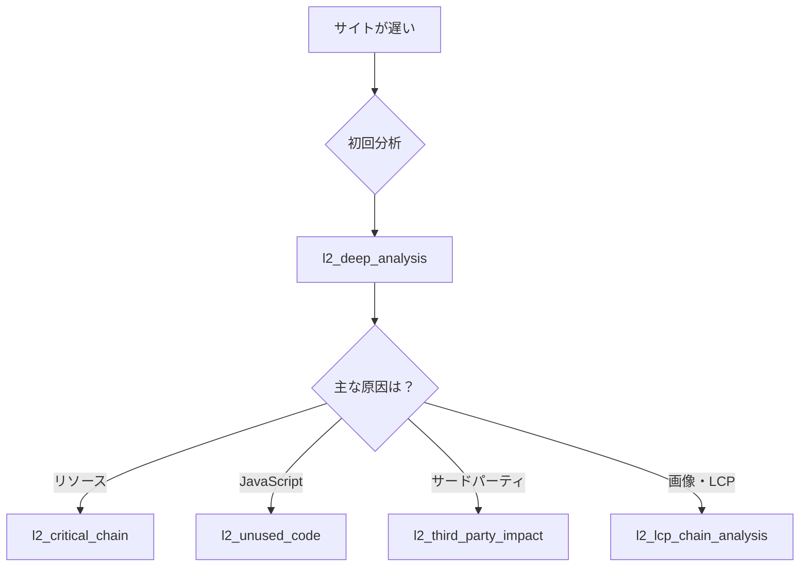

# Problem-Tool Matrix Quick Reference

## 🚨 パフォーマンス問題と推奨ツールの対応表

### Quick Lookup Table

| 問題・症状 | 第一選択ツール | 代替・補助ツール | 確認すべきメトリクス |
|-----------|---------------|-----------------|-------------------|
| **ページが遅い（全般）** | `l2_deep_analysis` | `l2_weighted_issues` | Performance Score, Core Web Vitals |
| **LCPが4秒以上** | `l2_lcp_chain_analysis` | `l2_critical_chain` | LCP, FCP, リソースチェーン |
| **クリックが反応しない** | `l2_deep_analysis` | `l2_third_party_impact` | FID, TBT, Max Potential FID |
| **レイアウトがずれる** | `l2_deep_analysis` | - | CLS, Layout Shift要素 |
| **JavaScriptが重い** | `l2_unused_code` | `l2_deep_analysis` | Bootup Time, Main Thread Work |
| **CSSが多すぎる** | `l2_unused_code` | `l2_deep_analysis` | Unused CSS, Coverage |
| **画像が遅い** | `l2_deep_analysis` | `l2_lcp_chain_analysis` | Image Optimization, Format |
| **広告・分析が重い** | `l2_third_party_impact` | `l2_progressive_third_party` | Third-party Summary |
| **スコアを上げたい** | `l2_score_analysis` | `l2_weighted_issues` | Audit Weights, Score Impact |
| **何から手をつけるか** | `l3_action_plan_generator` | `l2_weighted_issues` | Priority, Impact |

---

## 📊 症状別の詳細分析ガイド

### 1. 「サイトの表示が遅い」



**推奨手順**:
1. `l2_deep_analysis` で全体像を把握
2. 特定された主要問題に応じて専門ツールを使用
3. `l3_action_plan_generator` で改善計画を生成

### 2. 「Core Web Vitalsが悪い」

| CWV指標 | 不良基準 | 分析ツール | 改善の焦点 |
|---------|---------|-----------|-----------|
| **LCP** | > 4.0秒 | `l2_lcp_chain_analysis` → `l2_critical_chain` | 画像最適化、リソースチェーン、プリロード |
| **FID/INP** | > 300ms | `l2_deep_analysis` → `l2_third_party_impact` | JavaScript削減、コード分割、Web Worker |
| **CLS** | > 0.25 | `l2_deep_analysis` | サイズ属性、フォント、動的コンテンツ |

### 3. 「JavaScriptが重い・CPUを使いすぎ」

**診断フロー**:
```
1. l2_deep_analysis
   → Main Thread Work Breakdown確認
   → Script Evaluation時間確認

2. l2_unused_code
   → JavaScript Coverage確認
   → 未使用コードの特定

3. l2_third_party_impact
   → サードパーティの影響確認

4. 結果に基づく対策:
   - Code Splitting
   - Tree Shaking
   - Dynamic Import
   - Web Worker活用
```

### 4. 「モバイルで特に遅い」

**モバイル特有の問題分析**:

| 確認項目 | 使用ツール | チェックポイント |
|----------|-----------|---------------|
| CPU制限 | `l2_deep_analysis` | TBT > 600ms, Long Tasks |
| ネットワーク | `l2_critical_chain` | チェーンの長さ、転送サイズ |
| レンダリング | `l2_deep_analysis` | Render-blocking resources |
| JavaScript | `l2_unused_code` | Bootup time > 2000ms |

### 5. 「何から改善すべきか分からない」

**優先順位付けフロー**:

```
1. l2_weighted_issues
   ↓
   重み付けスコアTOP10を確認
   ↓
2. Quick Wins (effort: low) を特定
   ↓
3. l3_action_plan_generator
   ↓
   実装計画の生成
```

---

## 🎯 メトリクス異常値と対応ツール

### パフォーマンスメトリクスの閾値

| メトリクス | 良好 | 要改善 | 不良 | 分析ツール |
|-----------|------|--------|------|-----------|
| **Performance Score** | 90-100 | 50-89 | 0-49 | `l2_score_analysis` |
| **LCP** | < 2.5s | 2.5-4s | > 4s | `l2_lcp_chain_analysis` |
| **FID** | < 100ms | 100-300ms | > 300ms | `l2_deep_analysis` |
| **CLS** | < 0.1 | 0.1-0.25 | > 0.25 | `l2_deep_analysis` |
| **TBT** | < 200ms | 200-600ms | > 600ms | `l2_deep_analysis` |
| **Speed Index** | < 3.4s | 3.4-5.8s | > 5.8s | `l2_deep_analysis` |
| **TTI** | < 3.8s | 3.8-7.3s | > 7.3s | `l2_deep_analysis` |

### リソースメトリクスの警告値

| メトリクス | 警告値 | 危険値 | 分析ツール |
|-----------|--------|--------|-----------|
| **DOM Size** | > 1,500 | > 5,000 | `l2_deep_analysis` |
| **DOM Depth** | > 20 | > 32 | `l2_deep_analysis` |
| **JavaScript Size** | > 500KB | > 1MB | `l2_unused_code` |
| **CSS Size** | > 100KB | > 500KB | `l2_unused_code` |
| **Image Size** | > 200KB/個 | > 1MB/個 | `l2_deep_analysis` |
| **Request Count** | > 50 | > 100 | `l2_critical_chain` |

---

## 🔧 一般的な問題と解決策

### レンダリングブロック問題

**症状**: 白い画面が長く続く
**ツール**: `l2_critical_chain` + `l2_deep_analysis`
**確認項目**:
- render-blocking-resources
- critical request chain depth

**解決策**:
```javascript
// Before
<link rel="stylesheet" href="styles.css">

// After
<link rel="preload" href="styles.css" as="style">
<link rel="stylesheet" href="styles.css" media="print" onload="this.media='all'">
```

### 未使用コード問題

**症状**: バンドルサイズが大きい
**ツール**: `l2_unused_code`
**確認項目**:
- Coverage < 50%
- Unused bytes > 100KB

**解決策**:
```javascript
// Dynamic Import
const module = await import('./heavy-module.js');

// Tree Shaking
// webpack.config.js
optimization: {
  usedExports: true,
  sideEffects: false
}
```

### サードパーティ問題

**症状**: 外部スクリプトが遅い
**ツール**: `l2_third_party_impact` → `l2_progressive_third_party`
**確認項目**:
- Blocking time > 500ms
- Main thread impact > 1000ms

**解決策**:
```html
<!-- Async/Defer -->
<script async src="analytics.js"></script>
<script defer src="non-critical.js"></script>

<!-- Facade Pattern -->
<div id="video-placeholder" onclick="loadVideo()"></div>
```

### DOM/CSS複雑性問題

**症状**: スタイル計算が遅い、レイアウトスラッシング
**ツール**: `l2_deep_analysis`
**確認項目**:
- DOM size > 5000
- Style recalculation > 50ms
- Layout time > 50ms

**解決策**:
```css
/* Avoid expensive selectors */
/* Bad */
body > div > div > div > span { }
*:not(:first-child) { }

/* Good */
.specific-class { }
#specific-id { }

/* Use CSS containment */
.container {
  contain: layout style paint;
}
```

---

## 📈 改善効果の目安

| 改善施策 | 期待される効果 | 確認ツール |
|----------|--------------|-----------|
| 画像の遅延読み込み | LCP: -20%, Score: +5-10 | `l2_lcp_chain_analysis` |
| 未使用JS削除（50%） | TBT: -30%, Score: +5-15 | `l2_unused_code` |
| Critical CSS インライン化 | FCP: -20%, Score: +3-5 | `l2_critical_chain` |
| サードパーティ遅延 | TBT: -40%, Score: +10-20 | `l2_third_party_impact` |
| 画像フォーマット最適化 | Transfer: -50%, LCP: -10% | `l2_deep_analysis` |
| プリコネクト追加 | Resource timing: -200ms | `l2_critical_chain` |
| フォント最適化 | CLS: -50%, FCP: -10% | `l2_deep_analysis` |

---

## 🚀 Quick Start Commands

```bash
# 1. 初回の包括的分析
mcp l2_deep_analysis --url https://example.com

# 2. スコアが低い場合の詳細分析
mcp l2_score_analysis --url https://example.com
mcp l2_weighted_issues --url https://example.com --topN 10

# 3. LCPが遅い場合
mcp l2_lcp_chain_analysis --url https://example.com
mcp l2_critical_chain --url https://example.com

# 4. JavaScriptが重い場合
mcp l2_unused_code --url https://example.com
mcp l2_third_party_impact --url https://example.com

# 5. 改善計画の生成
mcp l3_action_plan_generator --url https://example.com
```

---

## 📚 関連ドキュメント

- [Analysis Capabilities](./analysis-capabilities.md) - 各ツールの詳細な機能説明
- [Tool Layers](./tool-layers.md) - L1/L2/L3層の設計思想
- [MCP Tools Catalog](./MCP-TOOLS-CATALOG.md) - 全ツールのカタログ