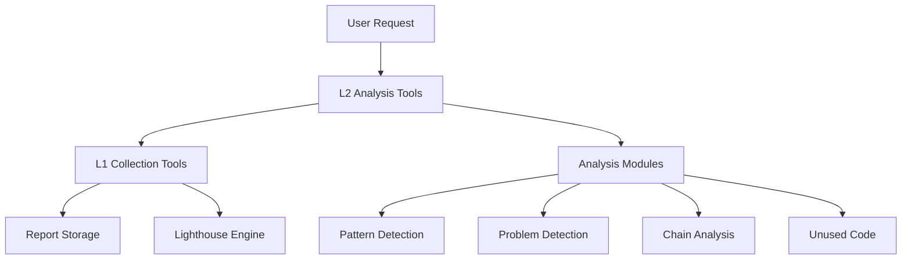

# Lighthouse MCP Tool Layers

## Architecture Overview

The Lighthouse MCP tools are organized into two distinct layers:

```
┌─────────────────────────────────────────────┐
│              User/Application               │
└─────────────────────────────────────────────┘
                    ↓
┌─────────────────────────────────────────────┐
│           L2: Analysis Layer                │
│  - High-level insights                      │
│  - Pattern detection                        │
│  - Recommendations                          │
│  - Critical chain analysis                  │
│  - Unused code detection                    │
└─────────────────────────────────────────────┘
                    ↓
┌─────────────────────────────────────────────┐
│          L1: Collection Layer               │
│  - Raw data collection                      │
│  - Report storage/retrieval                 │
│  - Cache management                         │
│  - No interpretation                        │
└─────────────────────────────────────────────┘
                    ↓
┌─────────────────────────────────────────────┐
│            Lighthouse Engine                │
└─────────────────────────────────────────────┘
```

## Layer 1: Collection Tools (Data Gathering)

These tools handle raw Lighthouse data collection and storage without any analysis or interpretation.

### Tools

#### `l1_collect`
- **Purpose**: Collect raw Lighthouse data for a single URL
- **Inputs**: URL, device type, categories, gather flag
- **Outputs**: Report ID, metadata, cache status
- **Cache**: Automatic (1 hour by default)

#### `l1_batch_collect`
- **Purpose**: Collect data for multiple URLs
- **Inputs**: URLs array, device type, categories
- **Outputs**: Array of report IDs with metadata

#### `l1_list_reports`
- **Purpose**: List stored reports with filtering
- **Inputs**: Optional filters (URL, device, limit)
- **Outputs**: Report metadata list

#### `l1_get_report`
- **Purpose**: Retrieve raw report data by ID
- **Inputs**: Report ID
- **Outputs**: Complete Lighthouse report JSON

### Usage Example

```typescript
// Collect data
const result = await executeL1Collect({
  url: 'https://example.com',
  device: 'mobile',
  gather: false // Use cache if available
});

// Get raw data
const report = await executeL1GetReport({
  reportId: result.reportId
});
```

## Layer 2: Analysis Tools (Intelligence)

These tools provide high-level analysis and insights based on L1 data.

### Tools

#### `l2_performance_analysis`
- **Purpose**: Comprehensive performance analysis
- **Inputs**: Report ID or URL
- **Outputs**: Metrics, problems, patterns, recommendations
- **Dependencies**: L1 collect/get tools

#### `l2_critical_chain`
- **Purpose**: Analyze critical request chains
- **Inputs**: Report ID or URL
- **Outputs**: Chain analysis, bottlenecks
- **Dependencies**: L1 tools

#### `l2_unused_code`
- **Purpose**: Detect unused CSS/JS
- **Inputs**: Report ID or URL, threshold
- **Outputs**: Unused resources, savings
- **Dependencies**: L1 tools

#### `l2_deep_analysis`
- **Purpose**: Comprehensive analysis combining all analyzers
- **Inputs**: Report ID or URL, analysis options
- **Outputs**: Complete analysis with all insights
- **Dependencies**: L1 tools, all analyzers

#### `l2_score_analysis`
- **Purpose**: Score breakdown and opportunities
- **Inputs**: Report ID or URL, category
- **Outputs**: Weighted metrics, opportunities
- **Dependencies**: L1 tools

### Usage Example

```typescript
// Analyze performance (will collect if needed)
const analysis = await executeL2PerformanceAnalysis({
  url: 'https://example.com',
  device: 'mobile'
});

// Or use existing report
const chainAnalysis = await executeL2CriticalChain({
  reportId: 'abc123',
  maxDepth: 5
});
```

## Tool Dependencies



## Benefits of Layer Separation

### 1. **Clear Separation of Concerns**
- L1: Data collection and storage
- L2: Analysis and insights

### 2. **Efficient Caching**
- L1 handles all caching logic
- L2 tools don't need to worry about data collection

### 3. **Reusability**
- Multiple L2 tools can use the same L1 data
- Analysis can be performed without re-collecting

### 4. **Flexibility**
- New L2 analysis tools can be added easily
- L1 tools remain stable and simple

### 5. **Performance**
- L1 tools are fast (just data retrieval)
- L2 tools can focus on complex analysis

## Migration from Legacy Tools

The legacy tools (`analyze_url`, `deep_analysis`, etc.) are maintained for backward compatibility but internally use the new layer architecture:

- `analyze_url` → Uses L1 for collection, L2 for analysis
- `deep_analysis` → Maps to `l2_deep_analysis`
- `analyze_stored` → Uses L1 storage tools
- `batch_analyze` → Uses `l1_batch_collect`

## Best Practices

1. **Use L2 tools for user-facing operations**
   - They handle collection automatically
   - Provide high-level insights

2. **Use L1 tools for data management**
   - Listing reports
   - Manual cache control
   - Raw data access

3. **Leverage caching**
   - Set `gather: false` for cached results
   - Use `gather: true` to force fresh collection

4. **Chain operations efficiently**
   - Collect once with L1
   - Run multiple L2 analyses on the same report